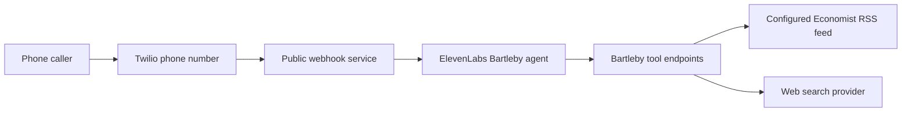

# Bartleby

Bartleby is a phone-callable ElevenLabs voice agent for talking through recent articles from *The Economist*. The goal is simple: call Bartleby, ask what is new in *The Economist*, and have a conversation grounded primarily in the current RSS feed.

This repository is intentionally standalone. It is modeled on the operating pattern of Andrew Furman's Phone Claw project, but it should not depend on Phone Claw code, configuration, deployment state, or the separate Economist newspaper RSS feed repository.

Bartleby is not affiliated with, endorsed by, or sponsored by *The Economist*.

## Product Shape

- Call a phone number and talk to an ElevenLabs Conversational AI agent named Bartleby.
- Ask for the latest items across the feed, or narrow by *The Economist* section.
- Use the RSS `category` tag as first-class section metadata, including sections such as `The World in Brief`, `The U.S. in Brief`, `Leaders`, `The United States`, `Business and Finance`, `Culture`, and `Obituary`.
- Retrieve article text from the configured RSS feed when the feed provides it.
- Use web search only as a secondary tool for external context, factual updates, or background that is not present in the RSS feed.
- Keep private feed URLs, tokens, phone numbers, and provider credentials outside the public repository.

## Relationship To Phone Claw

Phone Claw provides the reference architecture:

- Twilio receives the phone call.
- A public webhook layer connects the call to ElevenLabs.
- ElevenLabs handles the live voice conversation and calls webhook tools.
- Tool endpoints fetch RSS data, run web search, and return compact voice-friendly results.

Bartleby narrows that model to one domain: *The Economist*. It should be smaller, cleaner, and more opinionated than Phone Claw. It should not expose general email, GitHub, Claude Code, or personal assistant tools unless they become explicitly relevant later.

## Intended Architecture



The public webhook service should be deployable independently, likely as a Cloudflare Worker or a small Node/Fastify service. A private bridge may be useful if the RSS feed URL includes subscriber credentials or tokens that should never live in public Worker config.

## Core Tool Surface

The ElevenLabs agent should have a small, explicit tool set:

| Tool | Purpose |
| --- | --- |
| `economist_sections` | List known sections discovered from RSS `category` tags. |
| `economist_recent` | Return recent feed entries, optionally filtered by section/category. |
| `economist_search` | Search recent feed entries by keyword, section, and date range. |
| `economist_article` | Retrieve the full text or longest available RSS text for a specific entry. |
| `web_search` | Look up external background only when the RSS feed is insufficient. |

Tool responses should include stable entry IDs, title, URL, author when available, published date, section/category list, excerpt, and a short `answer_text` field that is safe for the voice agent to read aloud.

## RSS Feed Expectations

Bartleby should support one or more configured Economist RSS or Atom feeds. The real feed URL should be configured through environment variables or a host-local secret file, not committed.

Example private config shape:

```json
{
  "feeds": [
    {
      "id": "economist",
      "title": "The Economist",
      "url": "https://example.com/private-economist-feed.xml?token=replace-me",
      "private": true,
      "cache_seconds": 900
    }
  ]
}
```

The parser should preserve:

- `title`
- `link` or canonical URL
- `guid` or feed ID
- `pubDate`, `published`, or `updated`
- `author` or `dc:creator`
- `category` tags as sections
- `description`, `summary`, `content`, or `content:encoded`

If the feed only includes an excerpt, Bartleby should say that clearly instead of implying full-text access.

## Agent Behavior

Bartleby should answer like an informed, concise reading companion:

- Prefer *The Economist* RSS feed over web search.
- Mention the article title and section when grounding an answer.
- Distinguish what the article says from outside context.
- Use web search only for questions like "what happened after this was published?", "who is this person?", or "is there newer information elsewhere?"
- Say when the feed has no matching article or when only an excerpt is available.
- Keep spoken answers compact, then offer to go deeper.

## Configuration

Expected runtime secrets and config:

```bash
ELEVENLABS_API_KEY=
ELEVENLABS_AGENT_ID=
ELEVENLABS_API_BASE=https://api.elevenlabs.io
ELEVENLABS_TELEPHONY_AUDIO_FORMAT=ulaw_8000

TWILIO_PHONE_NUMBER=
TWILIO_WEBHOOK_TOKEN=
ALLOWED_CALLER_NUMBERS=

BARTLEBY_TOOL_TOKEN=
BARTLEBY_PUBLIC_BASE_URL=

ECONOMIST_RSS_CONFIG_PATH=/etc/bartleby/rss-feeds.json
ECONOMIST_RSS_CACHE_SECONDS=900
ECONOMIST_RSS_TIMEOUT_MS=12000

WEB_SEARCH_PROVIDER=auto
TAVILY_API_KEY=
```

Do not commit `.env`, provider secrets, real phone numbers, subscriber RSS URLs, API keys, cookies, browser profiles, or exported configs that contain live operational identifiers.

## Setup Plan

1. Create an ElevenLabs Conversational AI agent named `Bartleby`.
2. Configure telephony audio formats for Twilio: `ulaw_8000` for both user input and agent output.
3. Deploy the public webhook service.
4. Store provider secrets in the hosting platform's secret manager.
5. Store the Economist RSS feed URL in a private config file or secret.
6. Attach the Bartleby RSS and web-search tools to the ElevenLabs agent.
7. Point the Twilio number's inbound webhook at the public service.
8. Run a live conversation smoke test:
   - "What is new in The World in Brief?"
   - "What are the latest U.S. stories?"
   - "Find recent Business and Finance pieces about AI."
   - "Tell me more about the second article."
   - "Search the web for background on that topic."

## Public Repository Rules

This public repo should contain implementation code, docs, and sanitized examples only. It should not contain:

- private Economist RSS feed URLs
- copied article archives
- full-text article dumps
- Twilio account identifiers or auth tokens
- ElevenLabs API keys
- caller allow-list phone numbers
- local deployment files with secrets

The bot should summarize and discuss articles for the authorized caller. It should not republish full articles or expose subscriber feed data publicly.

## Initial Scope

This initial commit is a README scaffold only. The next implementation pass should add:

- a minimal webhook service
- RSS parser with category preservation
- cache and refresh behavior
- ElevenLabs tool schemas
- web search adapter
- Twilio inbound-call route
- `.env.example`
- smoke tests for RSS recent/search/article flows
