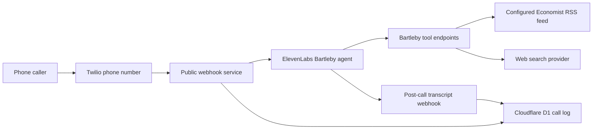

# Bartleby

Bartleby is a phone-callable ElevenLabs voice agent for talking through recent articles from *The Economist*. The goal is simple: call Bartleby, ask what is new in *The Economist*, and have a conversation grounded primarily in the current RSS feed.

This repository is intentionally standalone. It is modeled on the operating pattern of Andrew Furman's Phone Claw project, but it should not depend on Phone Claw code, configuration, deployment state, or the separate Economist newspaper RSS feed repository.

Bartleby is not affiliated with, endorsed by, or sponsored by *The Economist*.

## Product Shape

- Call a phone number and talk to an ElevenLabs Conversational AI agent named Bartleby.
- Ask for the latest items across the feed, or narrow by *The Economist* section.
- Use the RSS `category` tag as first-class section metadata, including sections such as `The World in Brief`, `The U.S. in Brief`, `Leaders`, `The United States`, `Business and Finance`, `Culture`, and `Obituary`.
- Retrieve article text from the configured RSS feed when the feed provides it.
- Default to *The Economist* RSS feed for answers; use web search only when the caller explicitly asks for outside context or the feed clearly cannot answer.
- Keep private feed URLs, tokens, phone numbers, and provider credentials outside the public repository.

## Relationship To Phone Claw

Phone Claw provides the reference architecture:

- Twilio receives the phone call.
- A public webhook layer connects the call to ElevenLabs.
- ElevenLabs handles the live voice conversation and calls webhook tools.
- Tool endpoints fetch RSS data first and return compact voice-friendly results. Web search exists only as a narrow fallback for external context.

Bartleby narrows that model to one domain: *The Economist*. It should be smaller, cleaner, and more opinionated than Phone Claw. It should not expose general email, GitHub, Claude Code, or personal assistant tools unless they become explicitly relevant later.

## Implemented Architecture



The public webhook service is a Cloudflare Worker, not Fastify. It is deployed at:

```text
https://bartleby.aifurman.workers.dev
```

The Worker handles Twilio inbound calls, Economist RSS tools, narrow outside web search, ElevenLabs post-call transcript logging, and password/token-protected admin transcript reads. Call and transcript data are stored in Cloudflare D1 only. No EC2 box, R2 bucket, S3-compatible object store, or separate private bridge is required for the initial scope.

## Core Tool Surface

The ElevenLabs agent should have a small, explicit tool set:

| Tool | Purpose |
| --- | --- |
| `economist_sections` | List known sections discovered from RSS `category` tags. |
| `economist_recent` | Return recent feed entries, optionally filtered by section/category. |
| `economist_search` | Search recent feed entries by keyword, section, and date range. |
| `economist_article` | Retrieve the full text or longest available RSS text for a specific entry. |
| `web_search` | Look up external background only when the caller asks for non-Economist context or the RSS feed clearly does not contain the answer. |

Tool responses should include stable entry IDs, title, URL, author when available, published date, section/category list, excerpt, and a short `answer_text` field that is safe for the voice agent to read aloud.

The agent should never use `web_search` merely because a question is current, broad, or complicated. It should first check the Economist RSS tools, answer from those articles when possible, and only then use search if the user requested outside information or the RSS result establishes a real gap.

## Call Logging

Bartleby logs into Cloudflare D1:

- Twilio inbound and status events
- caller/called numbers and allow-list decision
- ElevenLabs conversation ID
- transcript turns
- tool calls and tool results
- analysis summary
- metadata and conversation-initiation variables
- full transcript text

Admin reads are token protected:

```text
GET /admin/conversations
GET /admin/conversations/:conversation_id
GET /admin/calls/:twilio_call_sid
```

The Worker uses D1 for structured text logs only. It does not store audio blobs or raw webhook payload archives.

## RSS Feed Expectations

Bartleby should support one or more configured Economist RSS or Atom feeds. The real feed URL should be configured through environment variables or a host-local secret file, not committed.

Example private config shape:

```json
{
  "feeds": [
    {
      "id": "economist",
      "title": "The Economist",
      "url": "https://example.com/private-economist-feed.xml?token=replace-me",
      "private": true,
      "cache_seconds": 900
    }
  ]
}
```

The parser should preserve:

- `title`
- `link` or canonical URL
- `guid` or feed ID
- `pubDate`, `published`, or `updated`
- `author` or `dc:creator`
- `category` tags as sections
- `description`, `summary`, `content`, or `content:encoded`

If the feed only includes an excerpt, Bartleby should say that clearly instead of implying full-text access.

## Agent Behavior

Bartleby should answer like an informed, concise reading companion:

- Prefer *The Economist* RSS feed over web search.
- Mention the article title and section when grounding an answer.
- Distinguish what the article says from outside context.
- Use web search only when the caller explicitly asks for outside information, newer developments beyond an article, background on a person/place/company not explained in the article, or when RSS tools return no relevant Economist material.
- Before using web search, try `economist_recent`, `economist_search`, or `economist_article` unless the caller has clearly asked for sources beyond *The Economist*.
- When web search is used, state that the added context comes from outside *The Economist*.
- Say when the feed has no matching article or when only an excerpt is available.
- Keep spoken answers compact, then offer to go deeper.

## Configuration

Expected runtime secrets and config:

```bash
BARTLEBY_PUBLIC_BASE_URL=https://bartleby.aifurman.workers.dev
BARTLEBY_TOOL_TOKEN=
ADMIN_TOKEN=

ELEVENLABS_API_KEY=
ELEVENLABS_AGENT_ID=
ELEVENLABS_API_BASE=https://api.elevenlabs.io
ELEVENLABS_TELEPHONY_AUDIO_FORMAT=ulaw_8000
ELEVENLABS_POST_CALL_TOKEN=
ELEVENLABS_WEBHOOK_SECRET=

TWILIO_PHONE_NUMBER=
TWILIO_ACCOUNT_SID=
TWILIO_AUTH_TOKEN=
TWILIO_WEBHOOK_TOKEN=
ALLOWED_CALLER_NUMBERS=

ECONOMIST_RSS_URL=
ECONOMIST_RSS_CACHE_SECONDS=900
ECONOMIST_RSS_TIMEOUT_MS=12000

WEB_SEARCH_PROVIDER=auto
TAVILY_API_KEY=
```

Do not commit `.env`, provider secrets, real phone numbers, subscriber RSS URLs, API keys, cookies, browser profiles, or exported configs that contain live operational identifiers.

## Local Commands

Install dependencies:

```bash
npm install
```

Run checks:

```bash
npm run check
npm test
```

Deploy Worker:

```bash
npm run deploy
```

Apply D1 migrations:

```bash
npm run d1:migrate
```

Configure or create the ElevenLabs Bartleby agent and tools:

```bash
npm run elevenlabs:configure
```

Buy a new Twilio US local number or update an existing one:

```bash
TWILIO_PURCHASE_CONFIRM=true npm run twilio:provision
```

Run smoke checks:

```bash
npm run smoke:test
```

The smoke test verifies deployed health, optionally checks the Economist tool, inserts a synthetic ElevenLabs post-call transcript into D1, reads it back through the admin API, and can start a real Twilio test call when `TEST_CALL_FROM_NUMBER` and `BARTLEBY_TWILIO_PHONE_NUMBER` are configured.

## Setup Plan

1. Set `.env` from `.env.example` with ElevenLabs, Twilio, RSS, and auth values.
2. Store Worker secrets with `wrangler secret put`.
3. Run `npm run elevenlabs:configure`.
4. Configure the ElevenLabs post-call transcription webhook to:
   `https://bartleby.aifurman.workers.dev/elevenlabs/post-call?token=...`
5. Run `TWILIO_PURCHASE_CONFIRM=true npm run twilio:provision`.
6. Run `npm run smoke:test`.
7. Run a live conversation smoke test:
   - "What is new in The World in Brief?"
   - "What are the latest U.S. stories?"
   - "Find recent Business and Finance pieces about AI."
   - "Tell me more about the second article."
   - "Search the web for background on that topic."

## Public Repository Rules

This public repo should contain implementation code, docs, and sanitized examples only. It should not contain:

- private Economist RSS feed URLs
- copied article archives
- full-text article dumps
- Twilio account identifiers or auth tokens
- ElevenLabs API keys
- caller allow-list phone numbers
- local deployment files with secrets

The bot should summarize and discuss articles for the authorized caller. It should not republish full articles or expose subscriber feed data publicly.

## Initial Scope

The initial implementation includes:

- Cloudflare Worker webhook service
- Cloudflare D1 schema and deployed D1 database
- Economist RSS parser with category preservation
- Economist sections/recent/search/article tools
- narrow web-search fallback
- Twilio inbound-call route
- ElevenLabs post-call transcript logging
- admin transcript-read endpoints
- ElevenLabs tool configuration script
- Twilio number provisioning script
- smoke test script
- RSS parser tests
